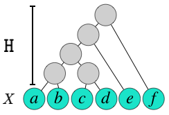
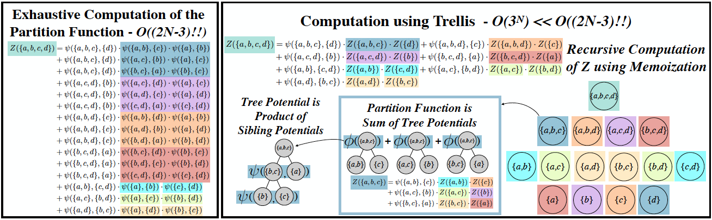

#  Data Structures and Algorithms for Exact Inference in Hierarchical Clustering 

### **Craig S. Greenberg\*, Sebastian Macaluso\*, Nicholas Monath, Ji-Ah Lee, Patrick  Flaherty, Kyle Cranmer, Andrew McGregor, Andrew McCallum.**
#### * Both authors contributed equally to this work.

Note that this is an early development version. 


[](https://opensource.org/licenses/MIT)


**ClusterTrellis** is a toolkit with ready to use and computationally efficient algorithms for finding exact solutions for the MAP hierarchy and partition function (marginal over all possible hierarchies) for any user defined model of hierarchical clustering that fits in the class we consider. In particular, the model should be written in terms of an energy function that factorizes as a product of pairwise splitting energies of each inner vertex in the hierarchy, e.g. the likelihood of a parent vertex splitting into two children. Also, the model parameters should be the same for every vertex and we currently consider only binary trees. If the model satisfies these requirements, then the user only needs to implement the pairwise splitting function (and an auxiliary function to calculate features of inner vertices in each model) and **ClusterTrellis** provides the algorithms. The toolkit also provides an algorithm to sample hierarchies from the exact true posterior distribution without enumerating all possible hierarchies.
See our  [paper](https://arxiv.org/abs/2002.11661) for more details about the algorithms, data structures and model requirements. A related library is [Ecole](https://www.ecole.ai/) that aims to expose a number of control problems arising in combinatorial optimization solvers as Markov Decision Processes.


## Introduction

Hierarchical clustering is a fundamental task often used to discover meaningful structures in data, such as phylogenetic trees, taxonomies of concepts, subtypes of cancer, and cascades of particle decays in particle physics. Typically approximate algorithms are used for inference due to the combinatorial number of possible hierarchical clusterings. In contrast to existing methods, we present novel dynamic-programming algorithms for **exact** inference in hierarchical clustering based on a novel trellis data structure, and we prove that we can exactly compute the partition function, maximum likelihood hierarchy, and marginal probabilities of sub-hierarchies and clusters. Our algorithms scale in time and space proportional to the powerset of N elements which is super-exponentially more efficient than explicitly considering each of the (2N-3)!! possible hierarchies. 

<!--This should be  a jpg file for the figure to be displayed-->


##### Fig. 1: Schematic representation of a hierarchical clustering. H denotes the latent state and X the dataset.


## Data Structure

<!--This should be  a jpg file for the figure to be displayed-->


##### Fig. 2: Computing the partition function for the dataset {a,b,c,d}. Left: exhaustive computation, consisting of the summation of (2x4-3)!! =15  energy equations. Right: computation using the trellis.  The sum for the partition function is over 2^{4-1} - 1 = 7 equations, each making use of a memoized partition function value. Colors indicate corresponding computations over siblings in the trellis.

## Installation

a) From TestPyPI:

`pip install -i https://test.pypi.org/simple/ ClusterTrellis==0.0.2`

b) From github repository

1. Clone the repository
2. `make install` from main dir.


## Interfacing your own model


To implement a new model for hierarchical clustering, each hierarchy should have an energy function that factorizes as a product of pairwise splitting energies $\psi$ of each inner vertex in the hierarchy (see `definition 2` in [`Data Structures & Algorithms for Exact Inference in Hierarchical Clustering`](https://arxiv.org/abs/2002.11661) for more details). Also, the current implementation assumes that the model parameters are the same for every vertex and only considers binary trees.


Use [`ClusterTrellis.ipynb`](examples/ClusterTrellis.ipynb) as a template to run the algorithm. 

To run the Cluster Trellis on a new model, define the `get_energy_of_split` and `compute_map_features` methods in the `ModelNode` class under the **Interfacing your Own Model** section. In particular,  get_energy_of_split represents the potential function $\psi$ introduced in the [paper](https://arxiv.org/abs/2002.11661), describing the compatibility of a pair of sibling nodes in a hierarchy H. The energy function $\psi$ for a pairwise splitting should be written in terms of map_features and model_params. Thus, compute_map_features is an auxiliary function to calculate features of internal vertices in the trellis. 

**map_features** (instance attribute): list of the model features/values for each vertex of a dataset, i.e.  [feature1, feature2, ... , featureN]. In particular, we initialize the algorithm with the leaves_features as a list with the features of each leaf. E.g. for Ginkgo this is [momentum, invariant mass] for each leaf.

**model_params** (instance attribute): dictionary with the model parameters.

### MAP hierarchy and partition function Z 

The trellis can be run step by step in section **Run Exact trellis on truth trees step by step** (more for debugging purposes) or it could be called with the `runTrellisOnly` function (recommended). In both cases replace `leaves_features` and `model_params` with your model values.

### Sampling hierarchies from the exact true posterior

Follow the instructions and run the **Posterior distribution from sampling** section.

## Example: Interfacing on Ginkgo 

[Ginkgo](https://github.com/SebastianMacaluso/ToyJetsShower) is a toy model for jets physics. A detailed description of the model can be found in [Ginkgo Notes](https://www.overleaf.com/read/pmmcqhyfsctf). Also, details and examples on how to access the jet binary tree structure in [`binaryTreeStructure.ipynb`](examples/binaryTreeStructure.ipynb).

This model can be run as an example in [`ClusterTrellis.ipynb`](examples/ClusterTrellis.ipynb).

### Partition function and maximum likelihood (MAP) hierarchy.

 The trellis implements a memoized dynamic program to compute the partition function and the MAP hierarchy. There are examples on how to run the algorithm and plot the results in [`ClusterTrellis.ipynb`](examples/ClusterTrellis.ipynb).


<pre>


</pre>
##### Fig. 3. Left: Scatter plot of the partition function Z  vs. the trellis MAP value for a dataset of Ginkgo jets, with up to 10 leaves (jet constituents). The color indicates the number of leaves of each hierarchical clustering. Right: Comparison of the posterior distribution for  a  jet with five leaves for sampling 10^5 hierarchies (black dots with small error bars) and expected posterior distribution (in green). The plot shows the discrete nature of the distribution. The log likelihood for the ground truth tree is a vertical dashed red line.

<pre>

</pre>

## Publications

A more detailed description of this work and implementations to other areas such as genomics can be found in our papers [Data Structures & Algorithms for Exact Inference in Hierarchical Clustering](https://arxiv.org/abs/2002.11661) and [Exact Inference on Hierarchical Clustering in Particle Physics and Cancer Genomics](https://ml4physicalsciences.github.io/2020/files/NeurIPS_ML4PS_2020_70.pdf).

-------------------------------------------------------------------------
## Citations

If you use this package, please cite our paper

```
@article{Greenberg:2020heb,
    author = "Greenberg, Craig S. and Macaluso, Sebastian and Monath, Nicholas and Lee, Ji-Ah and Flaherty, Patrick and Cranmer, Kyle and McGregor, Andrew and McCallum, Andrew",
    title = "{Data Structures \textbackslash{}\& Algorithms for Exact Inference in Hierarchical Clustering}",
    eprint = "2002.11661",
    archivePrefix = "arXiv",
    primaryClass = "cs.DS",
    month = "2",
    year = "2020"
}
```

## Acknowledgements 

[](https://nsf.gov/awardsearch/showAward?AWD_ID=1836650)

[](https://www.nsf.gov/awardsearch/showAward?AWD_ID=1450310)

[] 

This work was supported by the U.S. National Science Foundation (NSF) cooperative agreements [OAC-1836650 (IRIS-HEP)](https://nsf.gov/awardsearch/showAward?AWD_ID=1836650), [ACI-1450310](https://www.nsf.gov/awardsearch/showAward?AWD_ID=1450310) and [NSF-1763618](https://nsf.gov/awardsearch/showAward?AWD_ID=1763618&HistoricalAwards=false).

<pre>


</pre>

  
                   


